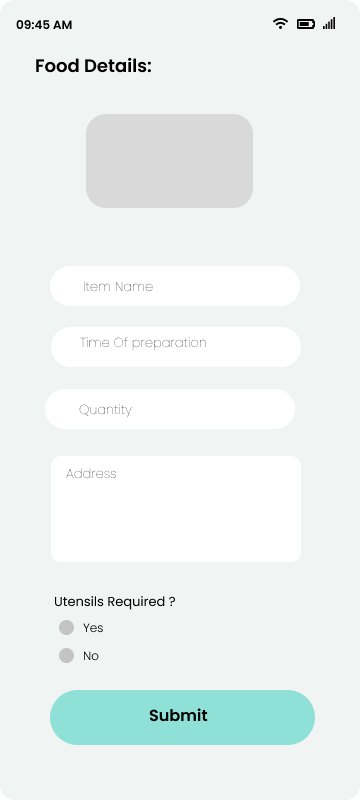
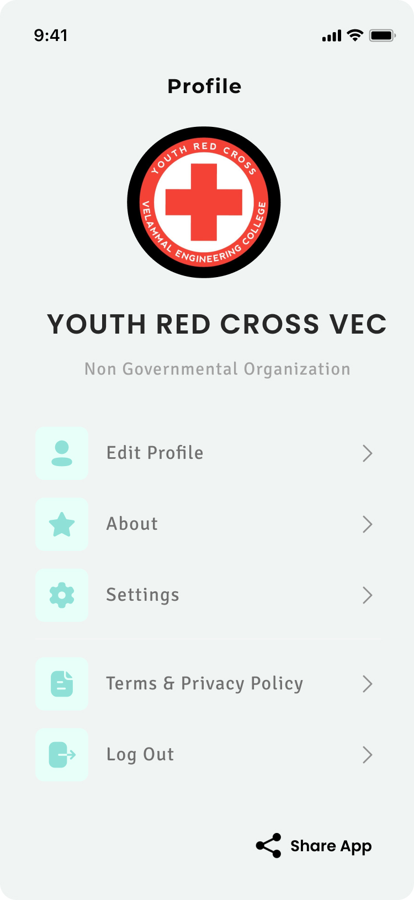

<h1 align="center"> Foodonate </h1>
 

 A Food donation app 

<!-- 

<image src ="https://user-images.githubusercontent.com/97015594/154835846-368f83f1-acce-4ac8-a997-e12e9c53a129.jpeg" height="350">

 -->

# Description
 
 
Foodonate is an android application that contains functionalities to donate food and receive or accept food. It establishes a direct link between the two parties including the donor which can be any authenticated individual and the service receiver which can be a needy individual, a volunteer wanting to provide food to the needy people in his/her society, any authorised NGO, an old-age home, etc with our application’s ease of delivery services. We are also honouring donors who have donated a considerable amount of time by highlighting and acknowledging them in the generous donors section of our application. An Android application containing functionalities to donate food and receive or accept food. It establishes a direct link between the two parties as well as provides the ease of delivery services.

 
# Screenshots of our App

 
 

 
 

 
 

# Features

 * An aesthetically designed UI.
 * Login, register and edit profile features for both donors and receivers.
 * You can choose from a list of options namely : make a donation, your donations, donation requests and request history.
 * ‘Make a donation’ option leads to where one can enter details about the donation being made like : item name, time of preparation, quantity, address and whether or not utensils are required.
 * ‘Your Donations’ displays the donations made by the user with a separate live donations section for those donations that are under process.
 * ‘Donation Requests’ displays the name of a person/organisation that has requested a particular item along with the requested item time stamped.
 * ‘Request History’ displays the history of requests made by the user.

# Technologies,Libraries and Packages Used

 * Kotlin
 * Firebase
 * Android Studio
 * Retrofit
 * Glide
 * XML

# Concepts Used

 * MVVM (Model-View-View Model) App Architecture
 * Recycler View
 * Data Binding
 * Jetpack Navigation Component

# Inspiration

Wasting food is a common problem in our society. The streets, garbage bins and landfills have ample proof to prove it. Marriages, canteens, restaurants, social and family get-togethers and functions expel so much food. Food wastage is not only an indication of hunger or pollution, but also of many economic problems. The high standard of living has resulted in the wastage of food because of quick changes in habits and lifestyle. Instead of wasting them we can put them in use by donating them to various organisations such as orphanages, old age homes, etc. We have identified the use of mobile technology to reduce food waste management and built an android mobile application that allows food donors, restaurants/individuals to donate and share their foods and leftovers with people in need. 

The ultimate objective of this project is to communicate that investments in food wastage reduction is the most logical step in the pursuit of sustainable production and consumption, including food security, climate change and other adverse environmental effects. Public awareness materials and a strategy will be developed to this effect.

# Local Setup
 
 1. Fork this repository
 2. Clone it in your local system
 3. Open Android Studio and select 'Open Project'. Browse through the file chooser to the folder where you have cloned the project. The file chooser will show an Android face as the folder icon, which you can select to open the project.
 4. After opening the project Android Studio will try to build the project directly. To build it manually, follow the menu path 'Build'/'Make Project', or just click the 'Play' button in the tool bar to build and run it in a mobile device or an emulator. The resulting .apk file will be saved in the 'build/outputs/apk/' subdirectory in the project folder.
 5. You can install the .apk file of Good Merchant in your device and enjoy it’s enrich features.
 

# What's next for Foodonate

Addition of a more efficient model will increase the ability to detect fraud and give authentication to the correct organisations only. Our project will need support from various places where food wastage is most common, and also, we will need fast delivery of food before it gets spoiled, so donor’s support and delivery organisations are our critical success factors. We expect that our app will scale well.

 
# Team Members

 * [Adarsh Pandey](https://github.com/addy0110)
 * [Ananya Mishra](https://github.com/Anan123ya)
 * [Rohit Lakra](https://github.com/RohitLakra299)
 * [Siddharth Singh](https://github.com/sekocoder)
